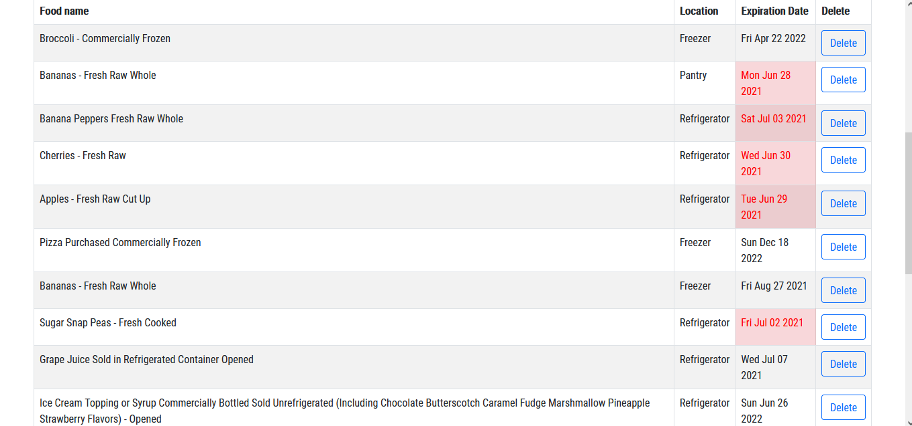

# Toss it! :wastebasket:

Toss it is a web application that allows users to search and save foods they have in their home and will notify the user when it is no longer safe to eat. The user first searches for foods they have, then are prompted to select where they are keeping it. Using the ShelfLife API and Python’s datetime library, the shelf life for that particular food is calculated and stored in the PostgreSQL database. When the food expires, the date turns red on the homepage using Javascript’s date library and an email is sent to the user using Schedule and Twilio’s Sendgrid APIs. When the user logs in again, they are able to see all of their food and are then able to delete any that they have either finished or has gone bad.

# Tech Stack

- Python
- JavaScript
- Flask 
- HTML 
- CSS
- Jinja
- Bootstrap
- PostgreSQL
- SQLAlchemy

# APIs Used

- Shelf-Life
- Twilio Sendgrid 
- Schedule

# Features

## Create an Account to Begin
Users create an account to join the platform. 

## Search for Foods 
Users can search for foods they have in their home and select where they are keeping them.
The shelf life is computed for them and will display on the homepage. 

## Notifications
When the expiration date arrives the date on the user's homepage will turn red and an email will be sent to 
the user's email they signed up with. 

## Filter
Users can select which location they want to view their food in and can toggle between them. 

# How to Install Toss It!

## Clone repository
Clone my github repo onto your local machine

``git clone https://github.com/aausen/food-exp.git``

## Create a virtual enviroment
`` virtualenv env ``

## Activate your virutal enviroment
`` source env/bin/activate ``

## Install requirements
`` pip install -r requirements.txt ``

## Sign up for a Twilio Sendgrid account to send email notifications and reieve an API key

## Save your Twilio Sendgrid API key and sender email in ``secrets.sh`` in the following format:
`` export API_KEY="YourAPIKey" ``

`` export sent_email="youremail@email.com" ``

## Source your key from your ``secrets.sh`` file to your virtual env

`` source secrets.sh ``

## Create your database

`` createdb food_exp ``

``python3 -i model.py ``

``  >> db.create_all() ``

## Run the application

`` python3 server.py ``

## Enjoy having fresh food and knowing when to Toss It!
